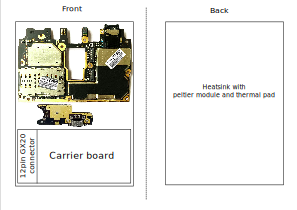

# flokit v1

1. Pocophone F1 as main processor.
2. 3D printed case
    1. Material: ABS 
    2. With threaded inserts.
    3. With provision for mounting. 
3. Heat sink with fan.
    1. Attached to processor with thermal paste. 
4. Carrier Board
    1. Input power through USB C. 
    2. 4 USB Type A 3.0 port connected to phone.
    3. 1 Ethernet port connected to USB port of the phone via ethernet to usb converter.
    4. 1 micro HDMI port connected to phone display port.
    5. Speaker
    6. Heatsink fan input.
    7. Connections to Pocophone F1
        1. B+ and B- from battery pcb.
        2. Display port
        3. Power and volume push button connector.
        4. USB C port
    8. STM32F401CCU6 connected to phone with 40 pin expantion header exposed.
    9. Toggle switch to disconnect power signal via USB to phone.
    10. LED to indicate whether phone is on or not.

  

